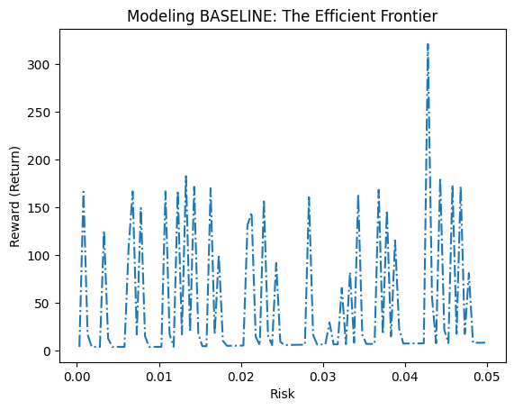
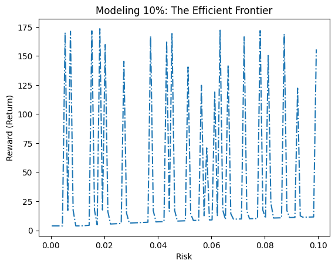
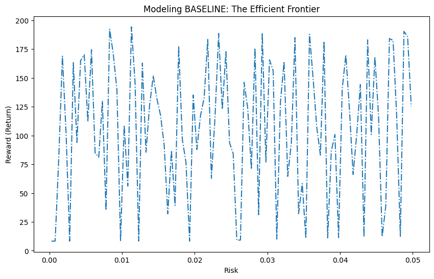

# Portfolio Optimization & Time-Series Analysis (Pyomo)

Team project (Modeling Lead). Built a portfolio optimization workflow for a 10-asset study, combining return engineering, risk metrics, and constrained optimization to generate and compare efficient frontiers under different risk limits.

> **Note:** Results are for academic demonstration only (not investment advice). “Return” and “Risk” reflect the project’s definitions and data transformations used in the notebook.

---

## What this project does
- Engineers asset return features from historical price series
- Computes risk/return metrics and compares portfolios across constraints
- Uses **Pyomo** to formulate and solve a constrained optimization problem
- Produces **efficient frontier** visualizations under multiple risk limits (baseline vs alternative constraints)

---

## Key Outputs (Efficient Frontiers)

### Josh — Baseline vs 10% Risk-Cap Model
Baseline shows higher upside at a tight risk cap (rare/extreme outcomes), while the 10% model provides a more stable profile with lower volatility at higher allowable risk.

<p align="center">
  
  
</p>

### Scott — Baseline vs Optimal Model (5% Risk Cap)
Scott’s baseline frontier achieves strong returns under a strict risk cap; higher-risk alternatives don’t necessarily improve the risk–return tradeoff.

<p align="center">
  
</p>

---

## Tech Stack
- Python
- Pyomo (optimization modeling)
- Pandas / NumPy
- Matplotlib

---

## How to run
1. Clone the repo:
   ```bash
   git clone https://github.com/jiaxinaspenlin-dotcom/portfolio-optimization-pyomo.git
   cd portfolio-optimization-pyomo
